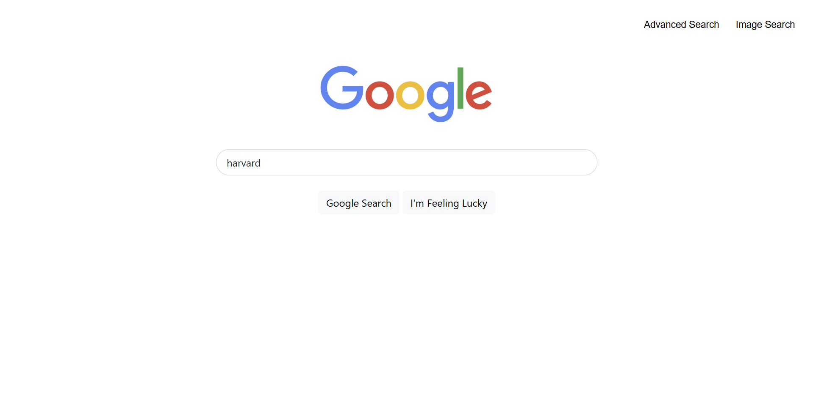
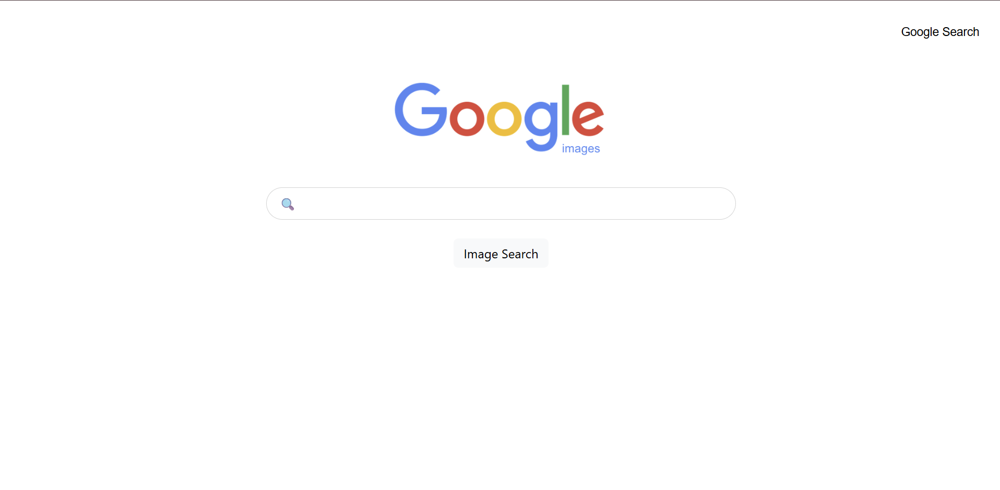
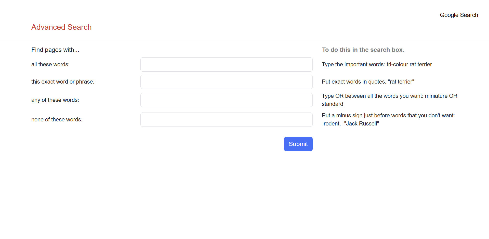

# Project 0: Search

## Overview
**Demo**: [https://youtu.be/llh3c0tvaCU](https://youtu.be/llh3c0tvaCU)

This project is a front-end implementation of a **Google Search**, **Google Image Search**, and **Google Advanced Search** interface. It replicates the look and basic behavior of Google’s search pages using only **HTML and CSS**, without any backend logic.

---

## Pages
This project consists of the following three pages:

- **`index.html`** – Google Search  
  - Allows users to enter a query and perform a standard Google search  
  - Includes a button to submit the search  
  - Provides navigation links to Image Search and Advanced Search  

    
     
    <em>Search</em>

- **`image_search.html`** – Google Image Search  
  - Allows users to search for images on Google  
  - Includes navigation back to the main search page  

    
     
    <em>Image Search</em>

- **`advanced_search.html`** – Google Advanced Search  
  - Provides multiple input fields for:
    - All these words
    - This exact word or phrase
    - Any of these words
    - None of these words
  - Submits queries using Google’s advanced search parameters  

    
     
    <em>Advanced Search</em>

---

## Features
- Responsive layout that resembles Google’s search pages 
- Navigation links between all three pages  
- Forms that submit search queries directly to Google using the correct URL parameters  
- Clean and minimal styling using CSS, Sass and Bootstrap  

---

## Technologies Used
- **HTML5**
- **CSS3**
- **Sass**

---

## How to Run
1. Download or clone this repository.
2. Open any of the HTML files in a web browser:
   - `index.html`
   - `image_search.html`
   - `advanced_search.html`
3. Enter a search query and submit — the browser will redirect to Google’s results page.
